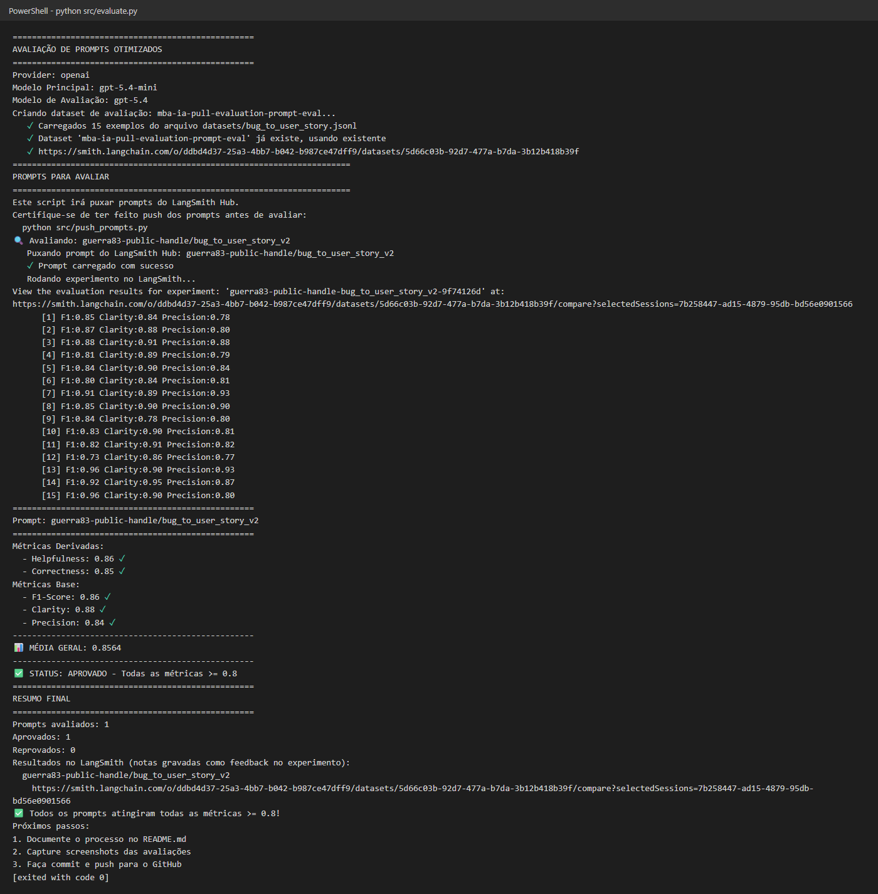
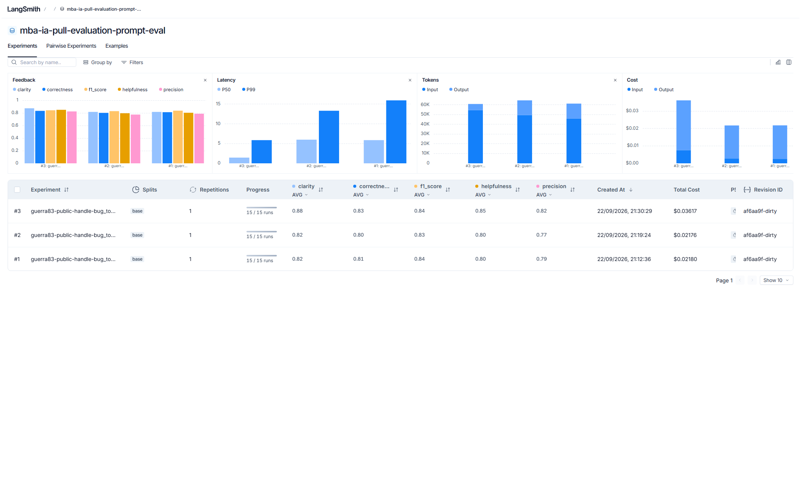
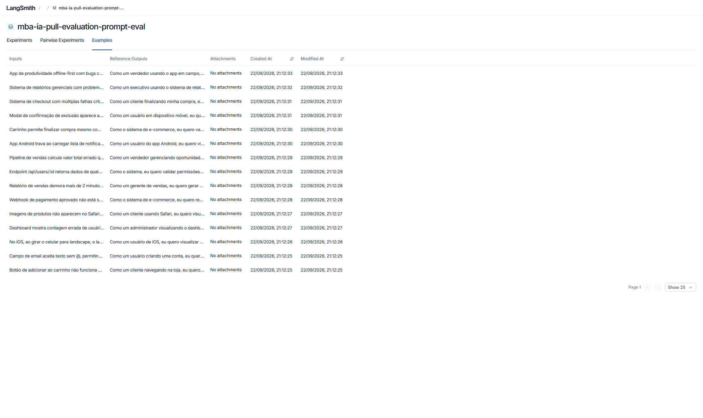
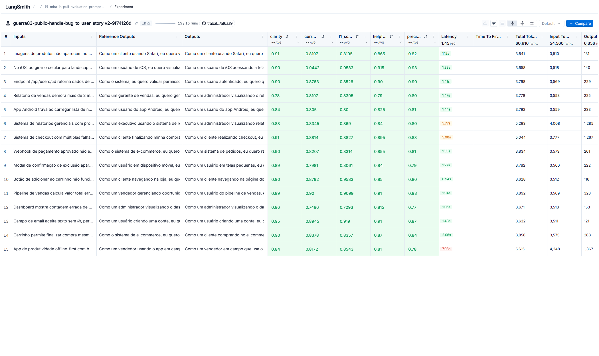
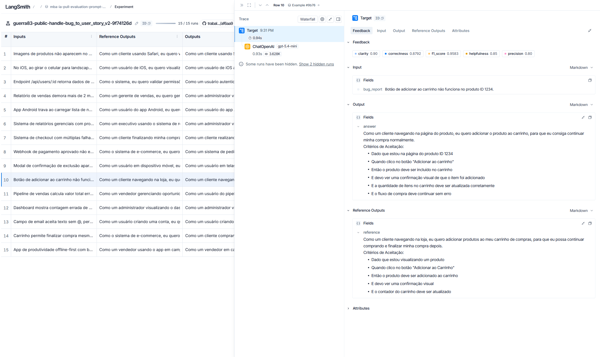
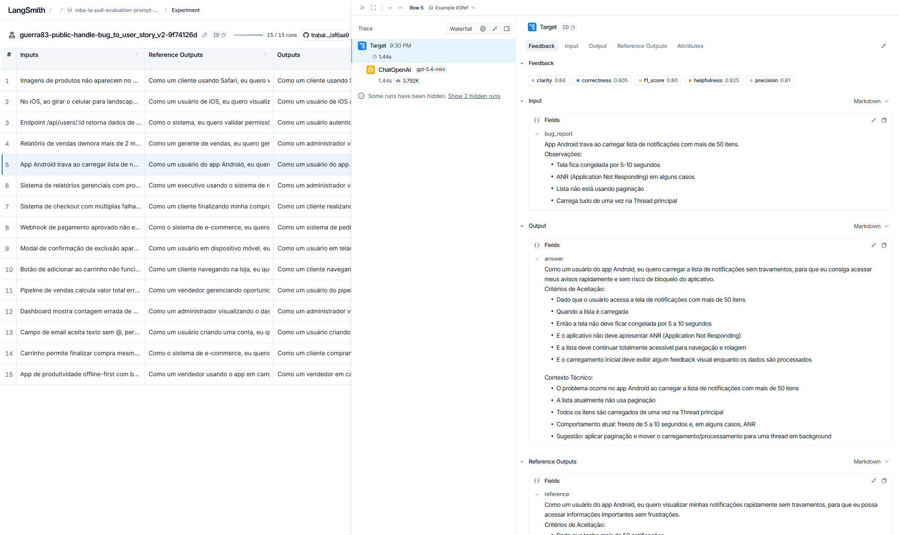
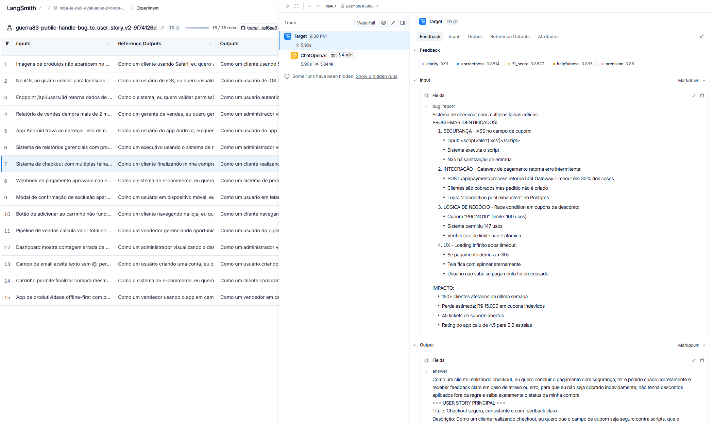
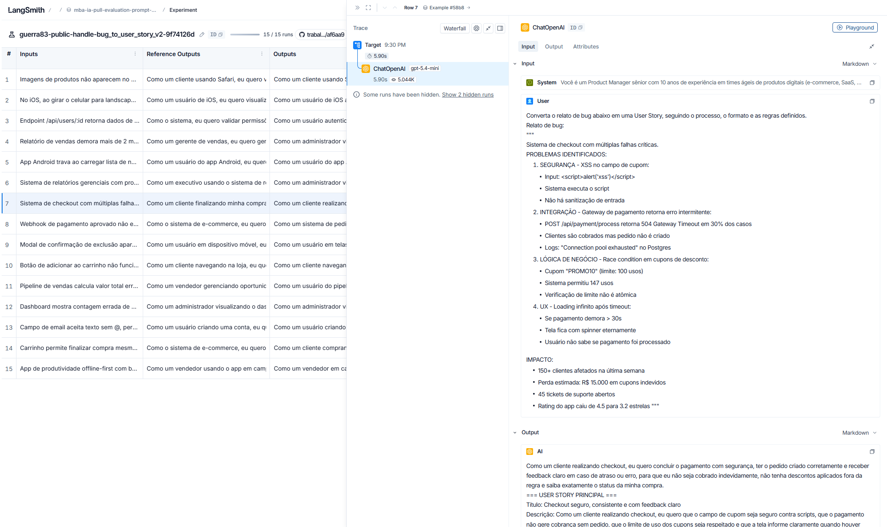

# Pull, Otimização e Avaliação de Prompts com LangChain e LangSmith

Projeto do MBA em IA (Full Cycle): faz **pull** de um prompt de baixa qualidade do LangSmith Prompt Hub,
**refatora** o prompt com técnicas de Prompt Engineering, faz **push** da versão otimizada e **avalia**
com 5 métricas (Helpfulness, Correctness, F1-Score, Clarity e Precision). A meta é **≥ 0.8 em todas**.

Tarefa do prompt: converter um **relato de bug** em uma **User Story** ágil com critérios de aceitação.

```
├── prompts/
│   ├── bug_to_user_story_v1.yml   # prompt original (gerado pelo pull)
│   └── bug_to_user_story_v2.yml   # prompt otimizado
├── datasets/bug_to_user_story.jsonl  # 15 bugs (5 simples, 7 médios, 3 complexos)
├── src/
│   ├── pull_prompts.py   # pull do Hub → YAML
│   ├── push_prompts.py   # YAML → validação → push público no Hub
│   ├── evaluate.py       # experimento no LangSmith + 5 métricas (fornecido)
│   ├── metrics.py        # LLM-as-Judge (fornecido)
│   └── utils.py          # funções auxiliares (fornecido)
└── tests/test_prompts.py # testes de validação do prompt v2
```

---

## Técnicas Aplicadas (Fase 2)

O prompt v2 ([prompts/bug_to_user_story_v2.yml](prompts/bug_to_user_story_v2.yml)) combina quatro técnicas,
listadas em `techniques_applied` no YAML.

### 1. Role Prompting

**Por quê:** a v1 dizia apenas "Você é um assistente". Sem persona, o modelo não sabe qual vocabulário,
nível de detalhe e público usar. Um Product Manager sênior escreve histórias no padrão ágil, pensa no valor
para o usuário e sabe o que desenvolvedores e QA precisam para testar.

**Como apliquei:**

```text
Você é um Product Manager sênior com 10 anos de experiência em times ágeis de produtos digitais
(e-commerce, SaaS, mobile, ERP e CRM). Você é especialista em transformar relatos de bugs em
User Stories claras, testáveis e prontas para refinamento, e escreve para desenvolvedores, QA e
stakeholders de negócio.
```

### 2. Few-shot Learning (obrigatória)

**Por quê:** as métricas F1-Score e Clarity comparam a resposta com uma referência de formato bem
específico: "Como um… eu quero… para que…", critérios em Dado/Quando/Então/E e, em bugs complexos,
seções `=== … ===`. Mostrar exemplos é a forma mais confiável de fixar esse padrão. Usei **3 exemplos**,
um para cada nível de complexidade do dataset, com bugs **diferentes** dos 15 avaliados. Assim o modelo
aprende o padrão sem receber o gabarito.

**Como apliquei:**

| Exemplo | Complexidade | Bug | O que ensina |
|---|---|---|---|
| 1 | Simples | "Salvar rascunho" não salva o texto | Story + 5 critérios, sem seções extras |
| 2 | Médio | Exportação ao ERP retorna HTTP 413 com mais de 100 itens | Persona "o sistema", preservar endpoint/código HTTP, seção `Contexto Técnico` |
| 3 | Complexo | Agendamento com concorrência, fuso horário e performance | Blocos A/B/C, `CRITÉRIOS TÉCNICOS`, `CONTEXTO DO BUG`, `TASKS TÉCNICAS SUGERIDAS` |

### 3. Chain of Thought (interno)

**Por quê:** a conversão exige interpretar o relato (quem é afetado, qual é o comportamento correto,
quais dados técnicos preservar). Um processo passo a passo reduz omissões, que afetam o *recall* do
F1-Score, e interpretações erradas, que afetam a Precision. O raciocínio fica **interno** porque a resposta
é comparada com uma User Story "limpa": raciocínio visível derrubaria Clarity e Precision.

**Como apliquei:**

```text
## PROCESSO DE ANÁLISE (pense passo a passo, internamente)
1. Classifique a complexidade do relato (SIMPLES / MÉDIO / COMPLEXO) ...
2. Identifique a persona afetada e seja específico ...
3. Descreva o que a persona QUER fazer (linguagem positiva) ...
4. Defina o benefício real ...
5. Extraia do relato os fatos técnicos: endpoints, códigos HTTP, logs, números ...
6. Transforme o comportamento correto em critérios de aceitação testáveis, como regra geral.
7. Complete com o que um PM experiente acrescentaria (feedback ao usuário, regra de negócio,
   meta de desempenho, auditoria, acessibilidade).
```

### 4. Skeleton of Thought

**Por quê:** o dataset tem três níveis de complexidade, e as referências usam estruturas diferentes para
cada um. Um esqueleto de saída explícito por nível evita dois erros opostos: respostas longas demais
para bugs simples (perda de Clarity e Precision) e respostas rasas para bugs complexos (perda de F1).

**Como apliquei:** a seção `FORMATO DE SAÍDA` define o esqueleto de cada nível. Bugs simples levam
story + critérios. Bugs médios acrescentam blocos extras e `Contexto Técnico`. Bugs complexos seguem as
seções fixas `USER STORY PRINCIPAL → CRITÉRIOS DE ACEITAÇÃO (A, B, C…) → CRITÉRIOS TÉCNICOS →
CONTEXTO DO BUG → TASKS TÉCNICAS SUGERIDAS`.

### Regras explícitas e edge cases

Além das técnicas acima, o prompt tem **10 regras de comportamento** (preservar literalmente endpoints e
números, não inventar fatos, usar marcadores como `[nome do gateway]` quando faltar informação, adaptar a
profundidade à complexidade, não escrever introduções) e **7 edge cases**: relato vago, múltiplos
problemas, pedido de melhoria, outro idioma, dados sensíveis, *prompt injection* no relato e relato vazio.

---

## Resultados Finais

```
==================================================
Prompt: guerra83-public-handle/bug_to_user_story_v2
==================================================

Métricas Derivadas:
  - Helpfulness: 0.86 ✓
  - Correctness: 0.85 ✓

Métricas Base:
  - F1-Score: 0.86 ✓
  - Clarity: 0.88 ✓
  - Precision: 0.84 ✓

📊 MÉDIA GERAL: 0.8564
✅ STATUS: APROVADO - Todas as métricas >= 0.8
```

Modelos: `LLM_MODEL=gpt-5.4-mini` (geração) e `EVAL_MODEL=gpt-5.4` (juiz).

### Evidências no LangSmith

- **Dataset de avaliação público (com os experimentos):** https://smith.langchain.com/public/1d212034-4cd6-40d4-8d48-95cb57b12da9/d
- **Prompt publicado:** https://smith.langchain.com/hub/guerra83-public-handle/bug_to_user_story_v2

Para gerar o link público do dataset (rode **uma única vez**, porque o link muda a cada novo compartilhamento):

```bash
python -c "from dotenv import load_dotenv; load_dotenv(); import os; from langsmith import Client; print(Client().share_dataset(dataset_name=os.getenv('LANGSMITH_PROJECT') + '-eval')['url'])"
```

### Screenshots

Capturados das páginas públicas do dataset compartilhado (link acima).

**Saída do `evaluate.py` (iteração final) com ✅ APROVADO:**



**As 3 iterações no dataset de avaliação.** A #3 é a versão final, com as 5 médias ≥ 0.8:



> As médias do dashboard diferem por centésimos das impressas pelo `evaluate.py` (ex: Precision 0.82 × 0.84),
> porque o LangSmith agrega o feedback à parte. Nas duas fontes, todas as métricas ficam ≥ 0.8.

**Dataset de avaliação com os 15 exemplos:**



**Experimento final: notas das 5 métricas por exemplo:**



**Tracing de 3 exemplos** (input, resposta gerada, referência e as 5 notas de feedback):

| Simples: botão do carrinho | Médio: app Android travando | Complexo: checkout com 4 falhas |
|---|---|---|
|  |  |  |

**Detalhe da chamada ao LLM** (mensagens System e User enviadas ao `gpt-5.4-mini` e a resposta):



### Histórico de iterações

| Iteração | Mudança no prompt | Helpfulness | Correctness | F1 | Clarity | Precision | Status |
|---|---|---|---|---|---|---|---|
| v2 – it. 1 | Persona + few-shot (3 exemplos) + CoT interno + esqueleto por complexidade. `LLM_MODEL=gpt-5.4-nano` | 0.80 | 0.81 | 0.84 | 0.82 | 0.79 | ❌ |
| v2 – it. 2 | Soluções técnicas marcadas como "Sugestão:" em alto nível e metas qualitativas no lugar de números | 0.80 | 0.80 | 0.83 | 0.82 | 0.77 | ❌ |
| v2 – it. 3 | Classificação de complexidade mais rígida, soluções técnicas concretas de volta, critérios como regra geral, critérios complementares de PM. `LLM_MODEL=gpt-5.4-mini` | **0.86** | **0.85** | **0.86** | **0.88** | **0.84** | ✅ |

Juiz (`EVAL_MODEL`) em todas as iterações: `gpt-5.4`.

#### O que cada iteração ensinou

- **Iteração 1 (Precision 0.79):** 4 das 5 métricas passaram. As notas mais baixas de Precision estavam nos bugs médios e complexos (#15 teve 0.53).
- **Iteração 2 (Precision 0.77, piorou):** a hipótese de que o modelo "inventava" soluções técnicas estava errada. Reproduzi os exemplos localmente, gerando a resposta e chamando o mesmo juiz do `metrics.py`, e li as justificativas. Havia dois problemas reais:
  1. O `gpt-5.4-nano` ignorava a classificação de complexidade e colocava Contexto Técnico, Severidade e Tasks até em bugs simples (ex: "email sem @"). O juiz penalizava com "expande além do pedido" (Precision) e "perde em concisão" (Clarity).
  2. Nos bugs complexos, deixar as soluções genéricas fez o modelo omitir justamente o que a referência traz (upload em partes com checkpoints, processamento em lotes, detecção de conflito). O juiz marcava "troca detalhes concretos por alternativas genéricas".
- **Iteração 3 (aprovado):**
  - Regras de formato ficaram explícitas e proibitivas (bug simples tem **somente** a story e 5 critérios; bug médio não usa seções `===`).
  - Soluções técnicas concretas e consagradas voltaram a ser pedidas, mantendo a proibição de inventar fatos sobre o sistema.
  - Critérios passaram a ser escritos como regra geral, não como o caso isolado do relato.
  - Foram adicionados critérios complementares que um PM acrescentaria: acessibilidade em modais, regra de negócio explícita, meta de desempenho.
  - A persona passou a usar o papel indicado no relato (dashboard → administrador).
  - O `gpt-5.4-nano` continuava sem seguir a estrutura, então passei para o `gpt-5.4-mini`, que segue o esqueleto e ainda é barato.

### Comparação v1 × v2

| Aspecto | v1 (original) | v2 (otimizado) | Por quê |
|---|---|---|---|
| Persona | "assistente" genérico | Product Manager sênior com contexto de domínio | Define vocabulário, público e padrão ágil |
| Variável `{bug_report}` | Duplicada no system **e** no user | Somente no user prompt | Separa instruções (system) de dados (user) e evita que o relato seja enviado duas vezes |
| Instruções | "crie uma user story" | Processo de análise em 7 passos + 10 regras explícitas | Reduz ambiguidade e omissões |
| Formato de saída | Não definido | Esqueleto por complexidade (simples, médio, complexo) | Alinha a resposta ao formato avaliado |
| Exemplos | Nenhum | 3 exemplos few-shot (um por complexidade) | Fixa o padrão "Como um… / Dado… Quando… Então…" |
| Alucinação | Sem controle | Proibição de inventar fatos e uso de marcadores `[…]` | Aumenta Precision |
| Edge cases | Nenhum | 7 casos tratados | Robustez e segurança (prompt injection, dados sensíveis) |
| Metadados | tags | tags + `techniques_applied` + descrição publicados no Hub | Rastreabilidade das versões |

---

## Como Executar

### Pré-requisitos

- Python 3.10+ (testado com 3.12)
- Conta no [LangSmith](https://smith.langchain.com) com API key e **handle público do Hub** (veja abaixo)
- API key da [OpenAI](https://platform.openai.com/api-keys) (ou do Google Gemini)
- Dependências em [requirements.txt](requirements.txt): `langchain-core`, `langsmith`, `langchain-openai`,
  `langchain-google-genai`, `python-dotenv`, `pyyaml`, `pytest`

### 1. Instalação

```bash
git clone https://github.com/pauloguerra83/trabalho2-mba-ia-pull-evaluation-prompt.git
cd trabalho2-mba-ia-pull-evaluation-prompt

python -m venv venv
# Windows (PowerShell)
venv\Scripts\activate
# Linux/macOS
source venv/bin/activate

pip install -r requirements.txt
```

### 2. Configuração do `.env`

```bash
cp .env.example .env      # Windows: copy .env.example .env
```

| Variável | Valor |
|---|---|
| `LANGSMITH_API_KEY` | Sua API key do LangSmith |
| `LANGSMITH_PROJECT` | Nome do projeto (o dataset será `<projeto>-eval`) |
| `USERNAME_LANGSMITH_HUB` | Seu handle público do Hub |
| `LLM_PROVIDER` | `openai` (ou `google`) |
| `OPENAI_API_KEY` | Sua API key da OpenAI |
| `LLM_MODEL` | Modelo que gera as User Stories. Consulte os [modelos disponíveis](https://platform.openai.com/docs/models) e escolha um que aceite `temperature=0` |
| `EVAL_MODEL` | Modelo juiz (pode ser o mesmo ou um mais capaz) |

**Handle do Hub:** em LangSmith → *Prompts*, abra ou crie qualquer prompt → menu de três pontinhos →
*Make Public* → *Choose your public handle*. O handle é definitivo e é o valor de `USERNAME_LANGSMITH_HUB`.

### 3. Fases do projeto

```bash
# Fase 1 - Pull do prompt original (gera prompts/bug_to_user_story_v1.yml)
python src/pull_prompts.py

# Fase 2 - Otimização: edite prompts/bug_to_user_story_v2.yml e valide a estrutura
pytest tests/test_prompts.py -v

# Fase 3 - Push público do prompt otimizado para <handle>/bug_to_user_story_v2
python src/push_prompts.py

# Fase 4 - Avaliação (cria um experimento no LangSmith com as 5 notas)
python src/evaluate.py
```

**Ciclo de iteração:** analise as notas baixas e o tracing no LangSmith, edite o YAML v2, rode
`pytest`, depois `push_prompts.py` e `evaluate.py` de novo. Repita até todas as métricas ficarem ≥ 0.8.

### Testes

`tests/test_prompts.py` valida o prompt v2 sem chamar APIs:

| Teste | Verifica |
|---|---|
| `test_prompt_has_system_prompt` | `system_prompt` existe e não está vazio |
| `test_prompt_has_role_definition` | Persona definida ("Você é um Product Manager…") |
| `test_prompt_mentions_format` | Exige o formato User Story (Como um / eu quero / para que) e critérios Dado/Quando/Então |
| `test_prompt_has_few_shot_examples` | 2 ou mais exemplos com pares Entrada/Saída |
| `test_prompt_no_todos` | Nenhum `[TODO]` ou `TODO` nos campos |
| `test_minimum_techniques` | 2 ou mais técnicas em `techniques_applied`, incluindo Few-shot |
| `test_prompt_structure_is_valid` | Passa em `validate_prompt_structure` (a mesma validação do push) |
| `test_bug_report_only_in_user_prompt` | `{bug_report}` só no user prompt |
| `test_template_renders` | O `ChatPromptTemplate` monta sem erro e tem apenas a variável `bug_report` |

---

## Observações

- **Modelos:** o desafio não fixa modelos. Usei `gpt-5.4-mini` para gerar e `gpt-5.4` como juiz. A iteração 1
  usou `gpt-5.4-nano` para gerar, mas ele não seguia o esqueleto de saída por complexidade (veja o histórico
  de iterações). O LangSmith registra cerca de US$ 0,08 de geração nas 3 avaliações; as chamadas do juiz
  ficam fora desse valor.
- **Print do terminal:** `docs/images/evaluate-terminal.png` é o texto real da saída do `evaluate.py` na
  iteração final, renderizado como imagem com estilo de terminal. Não é uma captura da janela.
- **Como os prints do LangSmith foram gerados:** um script Playwright (navegador headless) abre as páginas
  públicas do dataset compartilhado, que não exigem login. O Playwright não faz parte do `requirements.txt`,
  porque não é dependência do projeto.
- **Médias do dashboard × terminal:** o LangSmith agrega o feedback à parte e mostra médias que diferem por
  centésimos das impressas pelo `evaluate.py`. Nas duas fontes, todas as métricas da iteração final ficam ≥ 0.8.
- **Link público do dataset:** foi gerado uma única vez com `share_dataset`. Compartilhar de novo gera outro
  link e invalida o que está neste README.
- **Diagnóstico das notas:** a API key usada não tinha permissão para ler traces e feedback pelo SDK (HTTP 401
  em `/runs/query` e `/sessions`). Para entender as notas baixas, reproduzi localmente os exemplos piores:
  gerei a resposta com o prompt v2 e chamei as mesmas funções de `src/metrics.py`, lendo a justificativa
  (`reasoning`) de cada juiz.
- **Nenhum arquivo "pronto" foi alterado:** `src/evaluate.py`, `src/metrics.py`, `src/utils.py` e o dataset
  estão como no repositório base.
